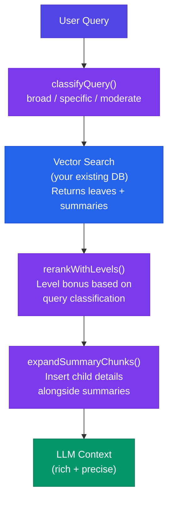

<p align="center">
  
  
  
  
</p>

# @craftrfp/hierarchical-rag

**RAPTOR-style hierarchical summarization for retrieval-augmented generation.**

Standard vector search retrieves isolated text chunks that lose the document's natural structure. This package adds hierarchical summary nodes — section-level and document-level — so your RAG pipeline returns both the big picture and the precise details.

```
Document
  └── Document Summary (level 2)    "RFP seeks cloud migration vendor, $450K budget..."
       ├── Section: Budget (level 1) "3-phase spend totaling $450K across infrastructure..."
       │    ├── Chunk 0 (level 0)    "Phase 1 budget is $150K for AWS migration..."
       │    └── Chunk 1 (level 0)    "Phase 2 allocates $200K for application..."
       └── Section: Timeline (level 1) "12-month delivery with quarterly milestones..."
            ├── Chunk 2 (level 0)    "Q1 deliverables include infrastructure setup..."
            └── Chunk 3 (level 0)    "Q3-Q4 focuses on testing and go-live..."
```

## Why

| Problem                              | How this solves it                                       |
| ------------------------------------ | -------------------------------------------------------- |
| Cross-section queries fail           | Summary nodes capture relationships between sections     |
| "Lost in the middle"                 | Hierarchy gives the LLM context at every level           |
| Broad questions return random chunks | Query classifier boosts summaries for conceptual queries |
| No structure awareness               | Preserves the document's natural section hierarchy       |

## Features

- **Summarization Pipeline** — Generates section and document summaries from leaf chunks
- **Query Classification** — Detects broad vs. specific queries using lightweight heuristics (no LLM)
- **Level-Aware Reranking** — Boosts summaries for broad queries, leaves for specific ones
- **Context Expansion** — When a summary ranks high, pulls its best child chunk alongside it
- **Framework Agnostic** — Bring your own LLM and embedding provider via dependency injection
- **Zero Dependencies** — Pure TypeScript, no runtime dependencies

## Install

```bash
npm install @craftrfp/hierarchical-rag
```

> **GitHub Packages:** Add `@craftrfp:registry=https://npm.pkg.github.com` to your `.npmrc`

## Quick Start

### 1. Create the summarization pipeline

```typescript
import { createSummarizationPipeline } from "@craftrfp/hierarchical-rag";

const pipeline = createSummarizationPipeline({
  llm: {
    // Plug in any LLM — Gemini, OpenAI, Anthropic, local models
    summarize: async (prompt) => {
      const result = await yourLLMClient.generate(prompt);
      return result.text;
    },
  },
  embedder: {
    embed: async (text) => yourEmbeddingClient.embed(text),
    embedBatch: async (texts) => yourEmbeddingClient.embedBatch(texts),
  },
});
```

### 2. Generate hierarchical summaries

```typescript
import type { LeafChunk } from "@craftrfp/hierarchical-rag";

// Your existing chunks from any chunking strategy
const leafChunks: LeafChunk[] = [
  {
    id: "c1",
    content: "Phase 1 costs $150K...",
    chunkIndex: 0,
    sectionHeader: "Budget",
    title: "RFP",
    score: 0,
  },
  {
    id: "c2",
    content: "Phase 2 costs $200K...",
    chunkIndex: 1,
    sectionHeader: "Budget",
    title: "RFP",
    score: 0,
  },
  {
    id: "c3",
    content: "Delivery in 12 months...",
    chunkIndex: 2,
    sectionHeader: "Timeline",
    title: "RFP",
    score: 0,
  },
];

const { sectionSummaries, documentSummary } = await pipeline.generateHierarchy(
  leafChunks,
  "Acme RFP",
);

// sectionSummaries[0] -> Budget summary (level 1) with childrenChunkIds: ['c1', 'c2']
// sectionSummaries[1] -> Timeline summary (level 1) with childrenChunkIds: ['c3']
// documentSummary    -> Full document summary (level 2)
```

### 3. Rerank with level awareness

```typescript
import { rerankWithLevels } from "@craftrfp/hierarchical-rag";

// After your vector search returns a mix of leaves + summaries
const reranked = rerankWithLevels(searchResults, userQuery, { topK: 5 });

// Broad query ("What is this RFP about?")     -> summaries rank higher
// Specific query ("What is the Phase 1 cost?") -> leaf chunks rank higher
```

### 4. Expand summaries with detail

```typescript
import { expandSummaryChunks } from "@craftrfp/hierarchical-rag";

const { chunks, expansions } = expandSummaryChunks(
  reranked, // top-K after reranking
  allChunks, // full chunk pool for child lookup
  { maxExpandedResults: 7 },
);

// If a Budget summary ranked #1, its best-matching leaf is inserted at #2
// LLM gets: [Budget Summary] + [Phase 1 detail] + [Timeline Summary] + ...
```

## API Reference

### `createSummarizationPipeline(config)`

Creates a pipeline that generates hierarchical summaries.

```typescript
type SummarizationConfig = {
  llm: LLMProvider; // { summarize(prompt: string): Promise<string> }
  embedder: EmbeddingProvider; // { embed(text): Promise<number[]>, embedBatch(texts): Promise<number[][]> }
  maxSectionSummaryWords?: number; // Default: 400
  maxDocumentSummaryWords?: number; // Default: 600
};
```

Returns an object with:

- `generateHierarchy(chunks, title?)` — Produces `{ sectionSummaries, documentSummary }`
- `groupChunksBySections(chunks)` — Groups chunks by `sectionHeader`

### `classifyQuery(query)`

Classifies a query as `BROAD`, `SPECIFIC`, or `MODERATE` using heuristics.

```typescript
const { type, confidence, signals } = classifyQuery(
  "What is the overall budget?",
);
// type: QueryType.BROAD
// confidence: 0.85
// signals: { wordCount: 6, hasNumbers: false, isBroadQuestion: true, ... }
```

### `rerankWithLevels(chunks, query, config?)`

Reranks chunks with level-aware scoring.

```typescript
type RerankingConfig = {
  weights?: Partial<RerankingWeights>; // Override default scoring weights
  topK?: number; // Default: 5
};

// Default weights:
// baseScore: 0.35, termFrequency: 0.20, positionScore: 0.10,
// titleBonus: 0.10, sectionBonus: 0.08, levelBonus: 0.17
```

### `expandSummaryChunks(ranked, allChunks, config?)`

Expands section summaries by inserting their best-matching child chunk.

```typescript
type ExpansionConfig = {
  maxExpandedResults?: number; // Default: 7
  childScoreLookup?: (chunkId: string) => number; // Custom scoring for child selection
};
```

## Hierarchy Levels

```typescript
import { ChunkLevel } from "@craftrfp/hierarchical-rag";

ChunkLevel.LEAF; // 0 — Original chunks (~400 tokens)
ChunkLevel.SECTION; // 1 — Section summaries
ChunkLevel.DOCUMENT; // 2 — Document summary
```

## How It Works



## Storage

This package generates summary nodes but does **not** handle storage. Store them however you like:

- **pgvector / Supabase** — Add `chunk_level`, `parent_chunk_id`, `children_chunk_ids` columns
- **Pinecone / Weaviate** — Use metadata fields for level and parent references
- **In-memory** — For testing or small datasets

## Evolution Path

This package is designed as **Phase A** of a two-phase approach:

| Phase           | Approach                                               | Query Cost           |
| --------------- | ------------------------------------------------------ | -------------------- |
| **A (current)** | RAPTOR collapsed tree — summaries in same vector index | Same as today        |
| **B (future)**  | Tree navigator — LLM traverses hierarchy for precision | +2-4 LLM calls/query |

Phase B adds a tree navigator module to this package. The types (`parentChunkId`, `childrenChunkIds`, `metadata`) are already in place.

## Development

```bash
git clone https://github.com/craftrfp/hierarchical-rag.git
cd hierarchical-rag
npm install
npm test          # Run tests in watch mode
npm run test:run  # Run tests once
npm run build     # Compile TypeScript
```

## License

[MIT](LICENSE)
